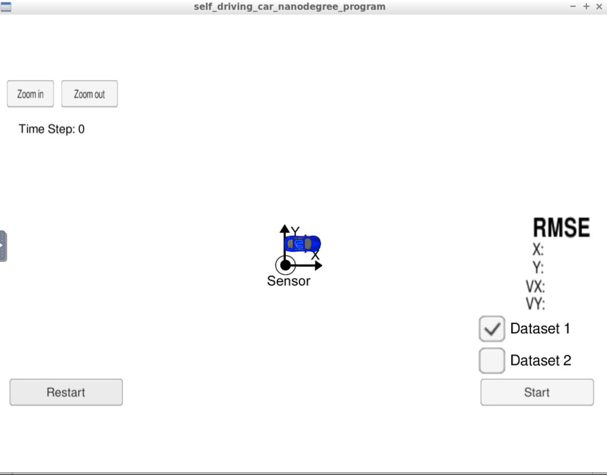
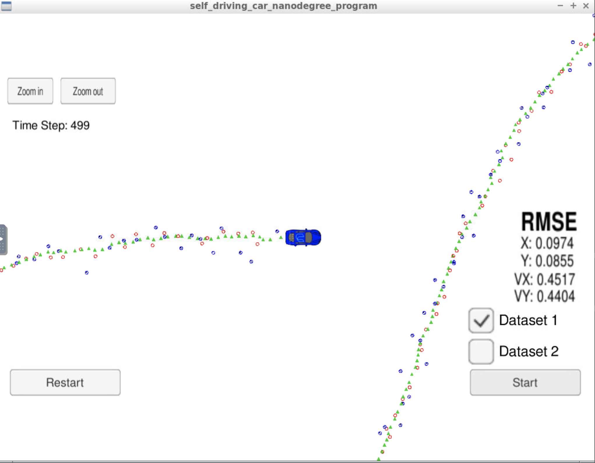
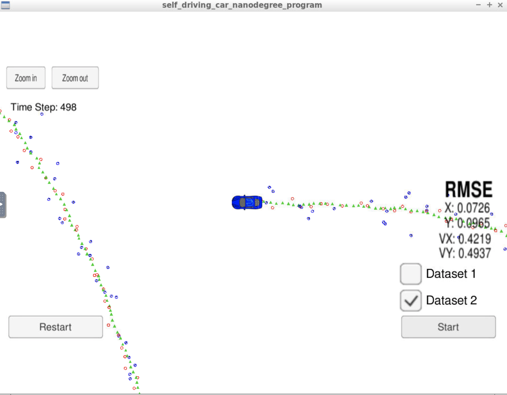

# CarND-Extended-Kalman-Filter
Udacity Self-Driving Car Nanodegree - Extended Kalman Filter

# Overview
This is a project on Extended Kalman Filter implementation with C++. Udacity provides a simulator that has noisy RADAR and LIDAR measurements of (position, velocity). An EKF - Extended Kalman Filter applies those measurements to predict position obj. Simulator and EKF server connect using Websocket and Udacity provides some datasets (seeds) to start with.

# Prereqs
Foloowing Build and Compilation Environments are need to make this project run successfully:
- cmake >= 3.5
- make >= 4.1
- gcc/g++ >= 5.4
- Udacity's simulator.

# Compiling and executing the project

In this project, I have used to workspace environment provided by Udacity and hence mostly, worked directly in that environment.

- Create the build directory: `mkdir build`
- `cd build`
- `cmake ..`
- `make`: This will create two executables
  - `ExtendedKF` : EKF implementation.
  - `Test` : Simple unit tests.

## Running the tests
From the build directory, execute `./Tests`. The output should be something similar to this:

```
ERROR - CalculateRMSE () - The estimations vector is empty
ERROR - CalculateRMSE () - The ground-truth vector is empty
ERROR - CalculateRMSE () - The ground-truth and estimations vectors must have the same size.
ERROR - CalculateJacobian () - The state vector must have size 4.
ERROR - CalculateJacobian () - Division by Zero
===============================================================================
All tests passed (13 assertions in 2 test cases)
```


## Running the Filter

From the build directory, execute `./ExtendedKF`. The output should be:

```
Listening to port 4567
Connected!!!
```

As you can see, the simulator connect to it then.

The following is an image of the simulator:



The simulator provides two datasets. The difference between them are:
- The direction in which car is running.
- Order of measurement data sent to EKF. With dataset 1, LIDAR measurement is sent in beginning. 
- On the dataset 2, RADAR measurement is sent first.

Simulator final state for dataset 1 with running EKL:



Simulator final state for dataset 2 with running EKL:



## Compiling

Program compiles fine without any errors. To add 'Tests' CMackeLists.txt is modified a little.

## Accuracy
### px, py, vx, vy outputs have RMSE <= [.11, .11, 0.52, 0.52] using file: "obj_pose-laser-radar-synthetic-input.txt that is same data simulator used for Dataset-1"

EKF accuracy values:
- Dataset-1 : RMSE <= [0.0974, 0.0855, 0.4517, 0.4404]
- Dataset-2 : RMSE <= [0.0726, 0.0965, 0.4219, 0.4937]

## Follow Correct Algorithm, Prediction and Updates
Kalman filter implementation is with src/kalman_filter*, src/FusionEKF.*, src/tools.* used to predict/update.

### Your Kalman Filter can handle radar and lidar measurements.
Different measurements and types are dealt with src/FusionEKF.cpp

## Code Efficiency

### Your algorithm should avoid unnecessary calculations.
Program is efficeint and aviods repeating calculation in kalman_filter.cpp with Q matrix calculation 
